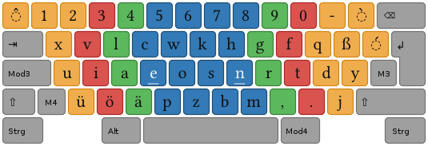

# Age of Empires Hotkey Science
Just trying to develop my optimal hotkeys

## What are My Values
- I need to be able to find my idle millitary units quickly
- I need to be able to find my idle villagers units quickly
- I need to be able to build buildings quickly here are my priorities
   - house
   - farm
   - town center
   - wood
   - pallisades
   - walls
   - pallisade gate
   - gate
   - barracks
   - stable
   - archery range
   - siege workshop
   - castle
   
- I don't need to mirror the layout of the buttons on screen to match the position of the keys on the keyboard

## What Keys I Have to Work With

