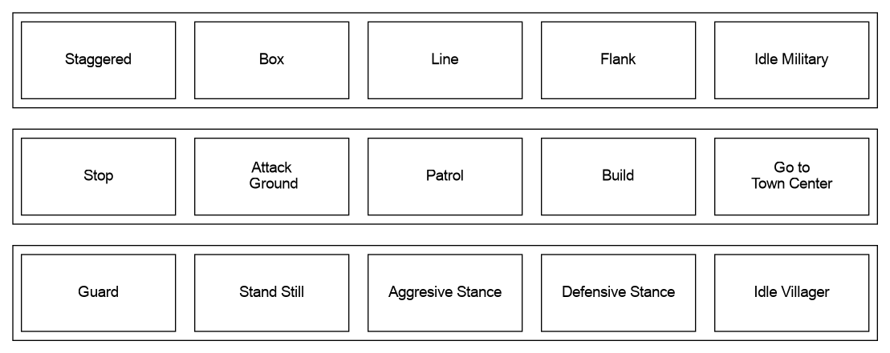
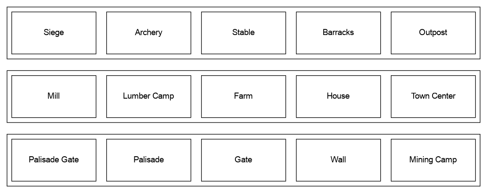
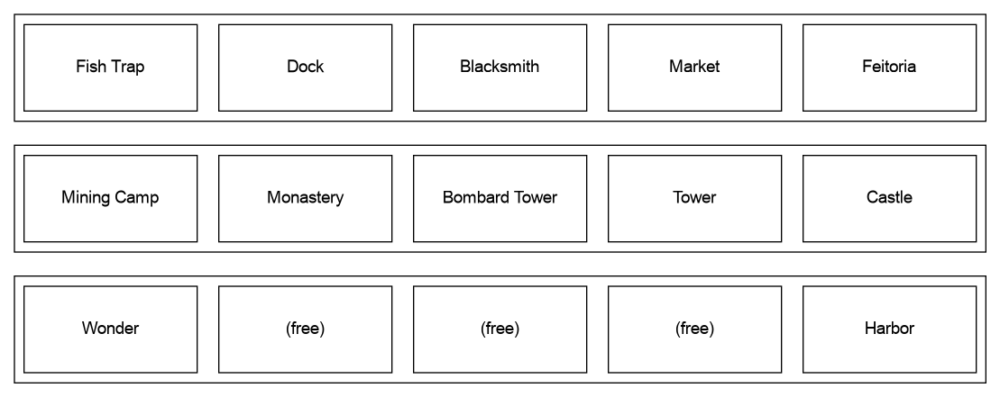

# Age of Empires Hotkey Science
Just trying to develop my optimal hotkeys

## What are My Values
- I need to be able to find my idle millitary units quickly
- I need to be able to find my idle villagers units quickly
- I need to be able to build buildings quickly here are my priorities
   - house
   - farm
   - town center
   - wood
   - pallisades
   - walls
   - pallisade gate
   - gate
   - barracks
   - stable
   - archery range
   - siege workshop
   - castle
- I need to be able to change the arrangement of my units quickly. I also need to be able to change how aggressive they are quickly
- I need to be able to produce units quickly especially the ones I like to use the most
- I don't need to mirror the layout of the buttons on screen to match the position of the keys on the keyboard

## What Keys I Have to Work With

Since my right hand is on the mouse in the game I only have the left half of the keyboard to work with.
Since I can still reach shift, alt and ctrl with my thumb I can unlock additional 3 layers as variations of these keys.

This leaves me with the following layout to use:

| x | v | l | c | w |
|---|---|---|---|---|
| u | i | a | e | o |
| ü | ö | ä | p | z |

These are 15 keys and they can be re-used with a modifier 3 more times for a sum of 60 possible bindings.

I seem to favor the right most keys of this layout the most but not the last keys to the right because I have to move my fingers from the home row to reach them. So my most important keys should be to the right but not in the last row.

## The Hotkeys
### Unit

### Build

### Build / Go to (Ctrl Modifier)

